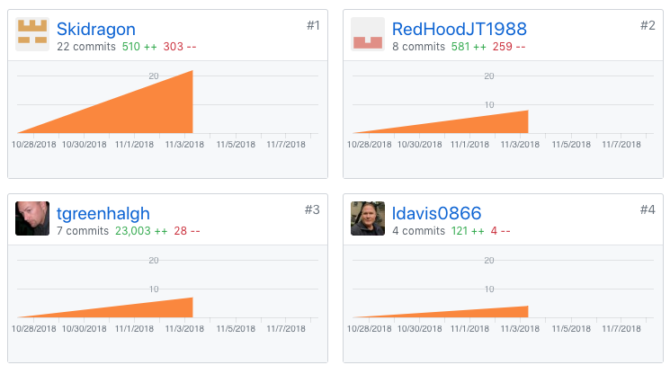

Welcome to the new blog, I hope you enjoy your stay! Click on for week 1 of our labs adventure!

<!-- end -->

## First week of Labs

As a team, we decided to go on a grand adventure and use a stack that none of us have ever used before, and tech, e.g. GraphQL, that none of us have used.



That's me, _tgreenhalgh_ 
*   I only had 7 commits, but 23k lines of code- I definitely need to commit more often
    *   a good chunk of the code is setting things up

Front End tasks
*   got the boiler plate code going
    *   https://trello.com/c/C0s82HkA
    *   https://github.com/Lambda-School-Labs/Labs8-AdventureTracker/pull/1
*   wrote the first draft of our readme
    *   https://trello.com/c/wvsAQO0F
    *   https://github.com/Lambda-School-Labs/Labs8-AdventureTracker/pull/3
*   connect frontend (React) to the Apollo server
    *   https://trello.com/c/G0nbLpDG
    *   https://github.com/Lambda-School-Labs/Labs8-AdventureTracker/pull/11
*   styling wasn't showing immediately on load
    *   https://trello.com/c/e7caP728
    *   https://github.com/Lambda-School-Labs/Labs8-AdventureTracker/pull/5

Back End tasks
*   got backend working locally
    *   https://trello.com/c/PgUksU7E
    *   https://github.com/Lambda-School-Labs/Labs8-AdventureTracker/pull/7
*   deploy backend
    *   https://trello.com/c/bm0U2JS2
    *   https://adventure-tracker-backend-ewlkjhhafm.now.sh/
*   Fixed a bug in "signin mutation"
    *   https://trello.com/c/jKderASz
    *   https://github.com/Lambda-School-Labs/Labs8-AdventureTracker/pull/18


### Connecting React to Apollo

One of the trickier pieces of setting up our project was connecting React to the Apollo server.  We are also using Next.js, so that had to be connected as well. To do this, I wrote a helper file.

```javascript
// to make it a Higher Order Component to expose Apollo via props
import withApollo from 'next-with-apollo';
// provides extra functionality, e.g. remote data fetching
import ApolloClient from 'apollo-boost';
import { endpoint } from '../config';
```
Next has a great module, `next-with-apollo` which is a Higher Order Component. (note to self: do blog about HOC). I also used `apollo-boost` which is the fastest way of creating an Apollo client. Finally, I have to include the URL endpoint.

```javascript
// need headers for auth
function createClient({ headers }) {
  return new ApolloClient({
    uri: process.env.NODE_ENV === 'development' ? endpoint : endpoint,
    ...
```

We're using JWT for authorization, so have to pass around the headers with all our calls. I create a new ApolloClient, passing it the URLs based on whether or not in development or production.

```javascript
    ...
    // include credentials (cookies) with every request
    request: operation => {
      operation.setContext({
        fetchOptions: {
          credentials: 'include'
        },
        headers
      });
    }

// exported as a function to be executed in _app.js
export default withApollo(createClient);
```

Then in our _app.js, we have

```javascript
import { ApolloProvider } from 'react-apollo';
import withData from '../lib/withData';

class MyApp extends App {
  ...
  render() {
    const { Component, apollo } = this.props;

    return (
      <Container>
        <ApolloProvider client={apollo}>
          <Page>
            <Component />
          </Page>
        </ApolloProvider>
      </Container>
    );
  }
}

// is a higher order compoment, wrapped in withData
export default withData(MyApp);
```

with the app being wrapped `withData` and all of our `Page` and `Component` components will have access to the Apollo client, giving us the ability to pass data around throughout our app.

----
## Life as a Team

Working with a team has actually been a really great experience. Everyone has been very open to discussion and we reach consensus quite quickly! I make sure to take time, several times a day, to reach out one-on-one with my teammates to make sure we're all on the same page, that everyone is feeling heard, and that we aren't getting bogged down anywhere.

We chose a very challenging stack, mostly at my urging, so I feel very responsible to make sure everyone is up-to-speed. I think picking such a hard stack has added to the friction, but I also think we're up to the task!  I'm excited to see what we come up with.

Our deployed page can be found at:
- frontend
  - https://clever-ramanujan-6abad4.netlify.com/
- backend
  - https://adventure-tracker-backend-ewlkjhhafm.now.sh/

and user accounts can be tested via the backend with:

```json
query showUsers {
  users {
    id
    name
    email
    password
  }
}

mutation addUser {
  signup(name:"New" email:"a@he.com" password:"shhh") {
    name
    password
  }
}

mutation deleteUser {
  deleteUser(id:"cjoajvugyjiqo0a0188kvtblr"){
    id
  }
}
```