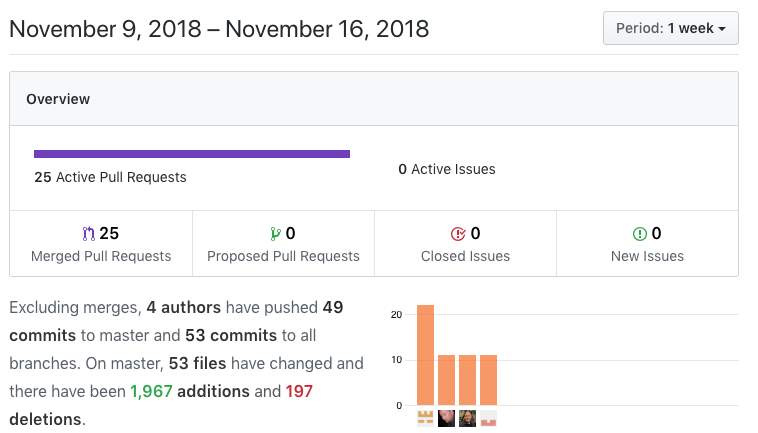
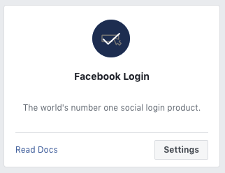
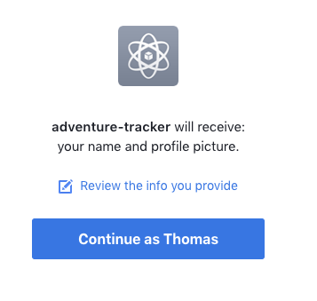

## Week 2 - APIs gone wild

To start the week off, we were given a whiteboard problem to "interview" another student with. The problem I was given was called mergePackages and you can watch me struggle [here](https://youtu.be/2R-W8eMvjJk). I was reminded to start off with the simplest naive solution that works and then try to optimize - I struggled quite a bit in the beginning trying to come up with a very efficient solution, then my interviewer suggested that I go with a basic solution, which I got done fairly quickly.

We only had a three day work week because Monday was a holiday, but we were still very productive!


This week I had 11 commits in 9 PRs.

Front End tasks
*   Connect front/back ends
    *   https://trello.com/c/GxtRhHB0
    *   https://github.com/Lambda-School-Labs/Labs8-AdventureTracker/pull/20
*   Build Login component
    *   https://trello.com/c/GxtRhHB0
    *   https://github.com/Lambda-School-Labs/Labs8-AdventureTracker/pull/21
*   Fix login bugs
    *   https://trello.com/c/LlSIr6ua
    *   https://github.com/Lambda-School-Labs/Labs8-AdventureTracker/pull/39
*   Adds "gated" components - only accessible when logged in
    *   https://trello.com/c/uVmA98D9
    *   https://github.com/Lambda-School-Labs/Labs8-AdventureTracker/pull/42
*   Begins facebook login
    *   https://trello.com/c/UAMvcOMX
    *   https://github.com/Lambda-School-Labs/Labs8-AdventureTracker/pull/45

Back End tasks
*   Implement login queries
    *   https://trello.com/c/GxtRhHB0
    *   https://github.com/Lambda-School-Labs/Labs8-AdventureTracker/pull/22
*   get CORS working, make a permanent link for deployed backend
    *   https://trello.com/c/LlSIr6ua
    *   https://github.com/Lambda-School-Labs/Labs8-AdventureTracker/pull/35
    *   https://github.com/Lambda-School-Labs/Labs8-AdventureTracker/pull/36
*   Server side stuff for facebook login
    *   https://trello.com/c/UAMvcOMX
    *   https://github.com/Lambda-School-Labs/Labs8-AdventureTracker/pull/48

We had several objectives this week, primarily having to do with API integration. We are using Stripe for payments, Google Maps for ... you guessed it, mapping, and OAuth so users can login with Facebook and Google.

---


The most challenging thing we worked on this week was getting OAuth working with Facebook. We are using [Passport](http://www.passportjs.org/) in express. After going to Facebook's developer page to add an app and get the app_id and app_secret, we were off and running - right into a brick wall. The initial setup wasn't too bad:

```javascript
express.use(passport.initialize());

passport.use(
  new FacebookStrategy(
    {
      clientID: process.env.FACEBOOK_APP_ID,
      clientSecret: process.env.FACEBOOK_APP_SECRET,
      // User grants permission and this is the callbackURL of what route
      // we want the user to go through
      callbackURL: 'https://adventuretracker.now.sh/auth/facebook/callback',

      // Specifying what fields I want from Facebook
      profileFields: ['id', 'displayName', 'email']
    },
    function(accessToken, refreshToken, profile, done) {
      //This happens first before the callbackURL happens.
      //The profile argument contains the needed information
      // it is an object
      done(null, profile);
    }
  )
);
```

A major issue is security and Facebook has made `https` mandatory for all apps that hit Facebook, so we had to ensure we used `https`. Our server is located on `https` and we could not figure out why it wasn't working - we would get
` "Insecure Login BLocked: You can't get an access token of log in to this app from an insecure page. Try re-loading the page as https://"`

So I added the force https package

```javascript
var secure = require('express-force-https');
...

// enforce HTTPS for all URLS
express.use(secure);
```

and it still did not work!  Quite frustrating, to be sure.  After much Googling, we found that the callback URL had to be complete. We had

```javascript
callbackURL: '/auth/facebook/callback',
```

in our code, but when changed to

```javascript
callbackURL: 'https://adventuretracker.now.sh/auth/facebook/callback',
```
Much success!!!



Now it is just a matter of taking the info returned from Facebook, passing it as a header to the frontend, extracting what we need, checking the DB to see if the user exists, if so, log in, if not, create and log in, set the cookies and we're done! :)

And do the whole thing over again with Google, but now that we know some of the tricks, I'm sure it'll be much easier.

---

Working with a team is really an interesting experience. Each person worked on an API, with me floating between everything. Communication and honesty is very important and I'm fortunate to be working with people who are fantastic! When someone gets stuck, they ask for help, and usually we get it fixed fairly quickly. Facebook was by far the biggest challenge and ended up taking a couple days. We started with ArcGIS but ended up switching to Google Maps because there were conflicts with Netlify after a couple days of fighting with it. Deadlines force some decisions; a sad truth.