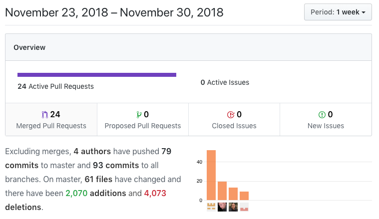

## The Whole Enchilda or, Life as a Team

This week's whiteboard problem is Ring Buffer. The video can be found [here](https://youtu.be/kssbGeLKPH8).


This was pretty rough week for us, but we were still slinging quite a bit of code:


This week I had 19 commits in 10 PRs. Adding Facebook OAuth was a good majority of the week, aside from working with my teammates on their pieces.

Front End tasks
*   Make it so people not logged in can't see certain pages
    *   [Trello Card](https://trello.com/c/uVmA98D9)
    *   [Github link](https://github.com/Lambda-School-Labs/Labs8-AdventureTracker/pull/42)
*   Facebook Oauth
    *   [Trello Card](https://trello.com/c/UAMvcOMX)
    *   [Github link](https://github.com/Lambda-School-Labs/Labs8-AdventureTracker/pull/45)
*   Facebook Oauth - add functionality to deployed frontend
    *   [Trello Card](https://trello.com/c/UAMvcOMX)
    *   [Github link](https://github.com/Lambda-School-Labs/Labs8-AdventureTracker/pull/67)
    *   [Github link](https://github.com/Lambda-School-Labs/Labs8-AdventureTracker/pull/68)
    *   [Github link](https://github.com/Lambda-School-Labs/Labs8-AdventureTracker/pull/69)
*   Fix login bugs
    *   [Trello Card](https://trello.com/c/LlSIr6ua)
    *   [Github link](https://github.com/Lambda-School-Labs/Labs8-AdventureTracker/pull/39)
*   Update mutations/queries to allow facebook login/signup
    *   [Trello Card](https://trello.com/c/UAMvcOMX)
    *   [Github link](https://github.com/Lambda-School-Labs/Labs8-AdventureTracker/pull/76)
*   Finishes frontend Facebook Oauth
    *   [Trello Card](https://trello.com/c/UAMvcOMX)
    *   [Github link](https://github.com/Lambda-School-Labs/Labs8-AdventureTracker/pull/80)

Back End tasks
*   Facebook OAuth via backend (later moved to frontend)
    *   [Trello Card](https://trello.com/c/UAMvcOMX)
    *   [Github link](https://github.com/Lambda-School-Labs/Labs8-AdventureTracker/pull/48)
*   Update schema to allow facebook login/signup
    *   [Trello Card](https://trello.com/c/UAMvcOMX)
    *   [Github link](https://github.com/Lambda-School-Labs/Labs8-AdventureTracker/pull/63)
*   Update mutations/queries to allow facebook login/signup
    *   [Trello Card](https://trello.com/c/UAMvcOMX)
    *   [Github link](https://github.com/Lambda-School-Labs/Labs8-AdventureTracker/pull/76)

The week we our task was to get all of the functionality going. We got part way there, needing to flesh out maps quite a bit more; namely trips and waypoints.

---

Facebook OAuth took a good chunk of the week for me. There was no good way to get the login from the backend to the frontend, which was our original plan, so I moved it to the frontend. Getting the schema setup wasn't too bad and Prisma is great about making all the connections for the data, so that was easy. Writing the mutations took just a bit as this is my first project with GraphQL. I have to say, though, that I'm loving it. Once everything was working, deployment woes immediately set in. Netlify wouldn't allow Facebook's pop-up to show! I scoured the docs, Googled the ins and outs of x-frames and then finally with a suggestion from Luis Hernandez (instructor extraordinaire at Lambda), it was solved!

Initial attempt. Our `.toml` file initially was set up for auto-deploying with every git merge.
```javascript
[build]
NODE_ENV = "prod"
base="frontend/"
publish="frontend/out/"
command="npm run export"
```

After reading through Netlify's docs, I added:
```javascript
[[headers]]
  for = "/*"
  [headers.values]
    X-Frame-Options = "allow-from https://www.facebook.com/"

[build]
NODE_ENV = "prod"
base="frontend/"
publish="frontend/out/"
command="npm run export"
```

Makes sense, right?  Need to allow the x-frame from Facebook. Part of what made this hard to fix was because of the constraints of the project, when each developer makes a pull request, another on the team has to read through the code and make sure it looks good. Then the project manager has to review everything and then merge the code. The Netlify kicks in and grabs the code and publishes it on the web. So after every change, I had to go through that process ... I don't envy the DevOps teams out there!

So that didn't work. Well, it kind of worked. For whatever reason, [Chrome](https://developer.mozilla.org/en-US/docs/Web/HTTP/Headers/X-Frame-Options#Browser_compatibility) does't deal with `X-Frame-Options`. Going through a bunch more documentation, I discover `Content-Security-Policy`. Which brings us to the shotgun approach I found on [MDN](https://developer.mozilla.org/en-US/docs/Web/HTTP/Headers/Content-Security-Policy#Multiple_content_security_policies):

```javascript
[[headers]]
  for = "/*"
  [headers.values]
    Content-Security-Policy = "frame-ancestors https://www.facebook.com; default-src 'self'; script-src 'self https://www.facebook.com/'; style-src 'self https://www.facebook.com/'"
```

So it's `push`, get approval from teammate, get PM to merge, wait to Netlify to do its thing, and then *crash*. Netlify has no idea what `self` is!  I circled back to Netlify's docs and see:

```javascript
[[headers]]
  for = "/*"
  [headers.values]
    Content-Security-Policy = "frame-ancestors https://www.facebook.com"
```

Once more, `push`, get approval from teammate, get PM to merge, wait to Netlify to do its thing, and then... it worked!!

Now that I know, I suppose it makes sense that `frame-ancestors` has to do with `X-frame-options` .. they both have `frame` in it :) But at the time, going through the Netlify docs, it was not the least bit obvious. It seems like having Facebook Oauth would be a fairly common use case and it would have been nice to have to explained clearly in their docs, but now I know.


---

The team experience is much the same; we've fallen into a rhythm. Everyone is working on their piece, then when they get stuck, they reach out. Integrating our work hasn't been too bad as we all are touching most of the parts at any given time. Not everyone is good with React, so that's been the trickiest part to work together on.
