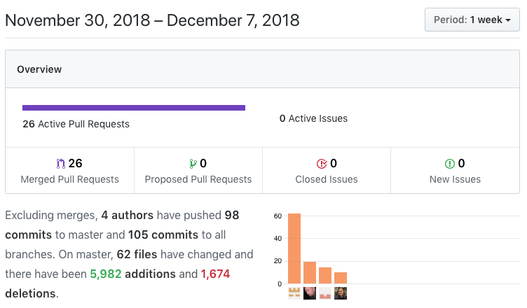

## Putting on some polish

### Code challenge

This week there was a mix-up and my assigned partner and I had the exact problem, so no real point in quizzing each other. Instead, we talked about how to avoid this issue for future cohorts. As it ends up, as there are a limited number of problems, there will be duplication if the process goes on long enough. But labs is a fixed amount of time, so we came up with a workable solution.

### Coding

In theory, this week was about polish, but we had a fair ways to go before MVP functionality was reached, so it was all hands on deck! Simon, as always, did amazing work getting some features added and did tons of styling.


This week I had 19 commits in 9 PRs. This week was all about saving the trips to the database, then being able to display current and archived trips. We were bitten by the `event-streams` hack, but I just had to update our `nodemon` and `npm-run-all` packages to handle that.

Front End tasks
*   Only show logout button if logged in
    *   [Trello Card](https://trello.com/)
    *   [Github link](https://github.com/Lambda-School-Labs/Labs8-AdventureTracker/pull/85)
*   Connect save trip button to db
    *   [Trello Card](https://trello.com/)
    *   [Github link](https://github.com/Lambda-School-Labs/Labs8-AdventureTracker/pull/98)
*   Show the user's trips
    *   [Trello Card](https://trello.com/c/)
    *   [Github link](https://github.com/Lambda-School-Labs/Labs8-AdventureTracker/pull/105)
*   Show the user's archived trips
    *   [Trello Card](https://trello.com/c/)
    *   [Github link](https://github.com/Lambda-School-Labs/Labs8-AdventureTracker/pull/110)
*   Shows the new trip as soon as added
    *   [Trello Card](https://trello.com/)
    *   [Github link](https://github.com/Lambda-School-Labs/Labs8-AdventureTracker/pull/111)

Back End tasks
*   Handle `event-stream` hack
    *   Trello Card N/A
    *   [Github link](https://github.com/Lambda-School-Labs/Labs8-AdventureTracker/pull/86)
*   Update schema, mutations, queries to handle trips
    *   [Trello Card](https://trello.com/)
    *   [Github link](https://github.com/Lambda-School-Labs/Labs8-AdventureTracker/pull/93)
*   Tweak database
    *   [Trello Card](https://trello.com/)
    *   [Github link](https://github.com/Lambda-School-Labs/Labs8-AdventureTracker/pull/94)
*   remove generated file from git - merge conflicts
    *   Trello Card N/A
    *   [Github link](https://github.com/Lambda-School-Labs/Labs8-AdventureTracker/pull/95)

The week we our task was to get all of the functionality going. We got part way there, needing to flesh out maps quite a bit more; namely trips and waypoints.

---


This was my week to really dig into GraphQL. One sets up the schema then Prisma builds all of the possible connections, relations, etc. Part of what makes GraphQL great is that there is just one end-point on the backend to hit for queries and the frontend can build whatever queries are wanted, digging into relationships as needed. A `query` is requesting data from the database and a `mutation` is making a change to data in the database.

The schema for our trips currently looks like

```javascript
type Mutation {
  createTrip(
    title: String!
    user: UserWhereUniqueInput!
    startDate: String!
    endDate: String!
    archived: Boolean!
    description: String
  ): Trip!
```

GraphQL is a strongly typed language, which is how it knows how to build the connections and relationships. `!` at the end means it is a required field. Note the the `user` type is `UserWhereUniqueInput!` This is because we need to be able to get trips that belong to a specific (unique) user. 

The `mutation` itself looks like

```javascript
{
  async createTrip(parent, args, ctx, info) {
    // comment out to test locally
    if (!ctx.request.userId) {
      throw new Error('You must be logged in to do that!');
    }

    const trip = await ctx.db.mutation.createTrip(
      {
        data: {
          // This is how to create a relationship between the Trip and the User
          user: {
            connect: {
              // commment out to test locally
              id: ctx.request.userId
              // uncomment to test locally
              // id: 'cjp8taz6je1ti0a62gfi12dw0'
            }
          },
          title: args.title,
          startDate: args.startDate,
          endDate: args.endDate,
          description: args.description,
          archived: args.archived,
          markers: args.markers
        }
      },
      info
    );
    return trip;
  }
```

Testing locally, getting it working, then deploying and confirming everything worked took a minute to figure out. Locally we don't have the `userId` which is passed around on the deployed site, so I had to comment out the "logged in" test and assign a `id` to tie to the trip being created.

In GraphQL Playground (an awesome tool that come with Prisma), I ran the following mutation to crate a trip:

```javascript
mutation createTrip {
  createTrip(archived:false, user:{id:"", email:"likothecat@hotmail.com", facebookID:"10216693062574561"}, title:"trip4", description:"happy trip", startDate:"12/5/18" endDate:"12/6/18"){
    id
    title
  }
}
```

Note that for `user` we have an object `{id:"", email:"likothecat@hotmail.com", facebookID:"10216693062574561"}` which is of type `UserWhereUniqueInput` as specified by the schema. The object

```
{
  id
  title
}
```

is what is returned from the query. This is what I get back when executing the mutation:
```javascript
{
  "data": {
    "createTrip": {
      "id": "cjpeczejm09co0a15q0a5e6dt",
      "title": "trip4"
    }
  }
}
```

---

As time began to run out, I had to spend more time working on things that had to get done, features and fixing bugs, than being able to help my teammates. I found self-contained things that were within the ability level of those who needed something to work on and had only a brief meeting with our frontend expert to make sure we didn't duplicate effort. I was able to "polish" some, but most of my efforts were in finishing MVP functionality. My outstanding task is to save the markers along with the trip.
