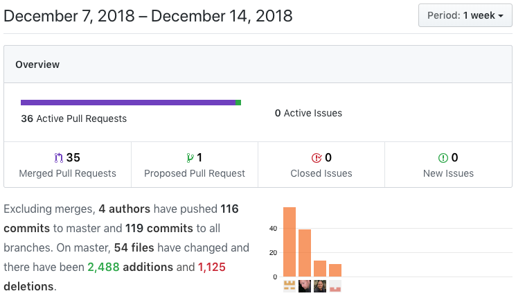

## The Final Week

### Capstone Defense

This week was the Capstone Defense - where we did a demo of our project for a panel of experts and then had one on one interviews with a frontend specialist and a computer science specialist. The demo went well and the interviews were great! I felt really confident with my responses and had a good time discussing our app.

### Coding

This week saw us scrambling to get some last minute functionality in and more polish. I pair programmed with Simon a couple of nights and we got quite a bit done.

This week I had 39 commits in 14 PRs. This week was all about saving the trips to the database, then being able to display current and archived trips. We were bitten by the `event-streams` hack, but I just had to update our `nodemon` and `npm-run-all` packages to handle that.

Front End tasks
*   Fix nav bar for deployed
    *   [Trello Card](https://trello.com/)
    *   [Github link](https://github.com/Lambda-School-Labs/Labs8-AdventureTracker/pull/113)
    *   [Github link](https://github.com/Lambda-School-Labs/Labs8-AdventureTracker/pull/114)
*   Fixed the class warning
    *   [Trello Card](https://trello.com/)
    *   [Github link](https://github.com/Lambda-School-Labs/Labs8-AdventureTracker/pull/115)
*   Show a new trip as soon as loaded
    *   [Trello Card](https://trello.com/c/)
    *   [Github link](https://github.com/Lambda-School-Labs/Labs8-AdventureTracker/pull/116)
*   Working out some deploy issues
    *   [Trello Card](https://trello.com/c/)
    *   [Github link](https://github.com/Lambda-School-Labs/Labs8-AdventureTracker/pull/120)
    *   [Github link](https://github.com/Lambda-School-Labs/Labs8-AdventureTracker/pull/121)
*   Adds ability to name a trip, did some formatting
    *   [Trello Card](https://trello.com/)
    *   [Github link](https://github.com/Lambda-School-Labs/Labs8-AdventureTracker/pull/124)
*   Updated Facebook login/signup functionality
    *   [Trello Card](https://trello.com/)
    *   [Github link](https://github.com/Lambda-School-Labs/Labs8-AdventureTracker/pull/137)

Back End tasks
*   updated the schema to handle dates
    *   [Trello Card](https://trello.com/)
    *   [Github link](https://github.com/Lambda-School-Labs/Labs8-AdventureTracker/pull/128)
    *   [Github link](https://github.com/Lambda-School-Labs/Labs8-AdventureTracker/pull/129)
*   Update schema, mutations to keep track of # of trips and whether the user has paid
    *   [Trello Card](https://trello.com/)
    *   [Github link](https://github.com/Lambda-School-Labs/Labs8-AdventureTracker/pull/133)
*   Add the tripId to createMap button
    *   [Trello Card](https://trello.com/)
    *   [Github link](https://github.com/Lambda-School-Labs/Labs8-AdventureTracker/pull/135)
*   Worked on mutations and queries for maps
    *   [Trello Card](https://trello.com/)
    *   [Github link](https://github.com/Lambda-School-Labs/Labs8-AdventureTracker/pull/142)
    *   [Github link](https://github.com/Lambda-School-Labs/Labs8-AdventureTracker/pull/145)

---

